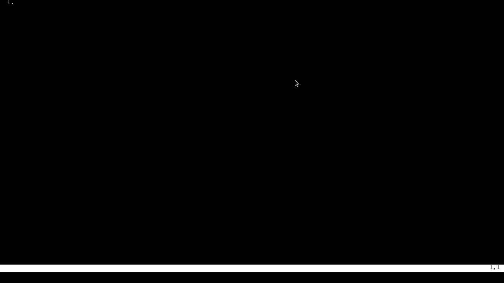

# wvim
A very simple vim clone for web!

It's basically a way worst version of vim!!!

It is a modal editor (normal, insertion and command modes) and <strike>amazingly</strike> it's also possible to edit mutiple buffers at the same time!

Take a look ate it!

  

Here are the avaiable commands:

# Normal Mode
| Key | Action       |
| --- | ------------ |
| h   | Move left    |
| j   | Move down    |
| k   | Move up      |
| l   | Move rigth   |
| i   | Insert*      |
| a   | Append**     |
| :   | Command Mode |

\*  Enter insert mode in the current character.

** Enter insert mode in the character after the current.

# Command Mode
| Key              | Action                  |
| ---------------- | ----------------------- |
| w                | Save File               |
| wd               | Save and download file  |
| q                | Close file              |
| wq               | Save and close file     |
| edit \<filename> | Edit a file             |

All the files you create with the `edit` command are saved in you `local storage`.

Well, there's not much more to say, it's just a little project I made, the code is a bit ugly, it's kinda buggy, but it was fun to make it and i learned some little things, maybe someday I rewrite it using the canvas API or WebGL.
